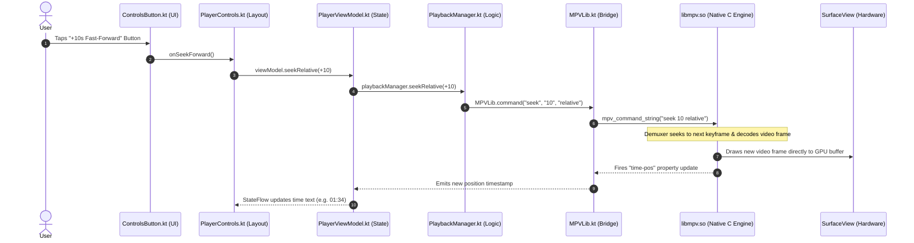

# 🔌 Feature Tracing: UI Tap to Native Core


In this lesson, you will walk the complete call stack of a real feature in **mpvRex**—tracing the path of a finger tap from the phone screen all the way down to native C machine instructions.

---

## 👶 1. The Beginner Analogy: Tracing the Electrical Wire

When you flip a light switch on your bedroom wall:
1. The switch closes a mechanical contact (**User Tap**).
2. Current travels through copper wires inside the drywall (**Compose Lambda & ViewModel**).
3. The current reaches the basement circuit breaker (**Manager & JNI Bridge**).
4. The breaker connects to the city electrical generator (**Native `libmpv` Engine**).
5. The bulb shines bright (**Video Frames change on Screen**).

Understanding an Android app means being able to trace that wire from end to end!

---

## 📊 2. Visual Architecture: The Complete Call Stack



---

## 🔍 3. The 5 Steps of the Call Chain Decoded

### 1. The UI Component (`ControlsButton.kt`)
The button defines its appearance and forwards the click:
```kotlin
@Composable
fun FastForwardButton(onClick: () -> Unit) {
    IconButton(onClick = onClick) {
        Icon(Icons.Default.FastForward, contentDescription = "Seek Forward")
    }
}
```

---

### 2. The Layout Orchestrator (`PlayerControls.kt`)
Connects the button to the ViewModel's event handler:
```kotlin
FastForwardButton(
    onClick = { viewModel.seekRelative(10) }
)
```

---

### 3. The State Holder (`PlayerViewModel.kt`)
Delegates business logic to the specialized playback manager:
```kotlin
fun seekRelative(seconds: Int) {
    playbackManager.seekRelative(seconds)
    scheduleControlsHide() // Reset HUD auto-hide timer!
}
```

---

### 4. The Domain Logic (`PlaybackManager.kt`)
Determines the seek precision and executes the command:
```kotlin
fun seekRelative(seconds: Int) {
    val mode = if (useExactSeeking) "relative+exact" else "relative+keyframes"
    MPVLib.command("seek", seconds.toString(), mode)
}
```

---

### 5. The JNI Bridge (`MPVLib.kt` & `libmpv.so`)
Calls compiled C machine code via JNI:
```kotlin
external fun command(vararg cmd: String)
```
Inside C/C++, `libmpv` receives the string `"seek 10 relative+exact"`, calculates the target presentation timestamp (PTS), flushes old decoded frames from memory, decodes the new target frame, and displays it on the `SurfaceView`!

---

## 🎯 4. Key Takeaways

- [x] Every feature in a media player follows a linear path: **UI ➔ ViewModel ➔ Manager ➔ JNI ➔ Native C ➔ Hardware**.
- [x] UI components remain completely agnostic of player internals—they only trigger lambdas.
- [x] The ViewModel coordinates UI timers (`scheduleControlsHide()`) while delegating playback logic to specialized Managers.
- [x] Once you understand this chain, you can locate and modify any button's behavior in minutes.
