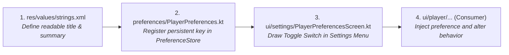

# 🛠️ Blueprint: Adding a New Preference & Setting


In this lesson, you will learn the exact 4-file blueprint for adding a new user setting to **mpvRex**—from defining strings to persisting user choices and wiring them into active player components.

---

## 👶 1. The Beginner Analogy: Adding a New Wall Switch

Adding a feature toggle to an app is like installing a new light switch in your house:
1. Print a label for the switch (**`strings.xml`**).
2. Wire the switch to the breaker box (**`PlayerPreferences.kt`**).
3. Mount the switch plate on the wall (**`SettingsScreen.kt`**).
4. Connect the power wire to the actual ceiling lamp (**`Seekbar.kt`**).

---

## 📊 2. Visual Architecture: The 4-File Recipe



---

## 🔍 3. The Step-by-Step Implementation Blueprint

### Step 1: Declare Strings (`res/values/strings.xml`)
Never hardcode text strings in Kotlin code:
```xml
<string name="pref_white_seekbar_title">White Seekbar</string>
<string name="pref_white_seekbar_summary">Draw the video progress bar in solid white instead of theme accent</string>
```

---

### Step 2: Register in Preferences (`PlayerPreferences.kt`)
Define the key name and default value:
```kotlin
class PlayerPreferences(preferenceStore: PreferenceStore) {
    // Defines persistent boolean toggle (defaults to false):
    val whiteSeekBar = preferenceStore.getBoolean("white_seekbar", false)
}
```

---

### Step 3: Render Switch in Settings (`PlayerPreferencesScreen.kt`)
Add the toggle item to the settings screen list:
```kotlin
@Composable
fun PlayerPreferencesScreen() {
    val preferences = koinInject<PlayerPreferences>()

    PreferenceSwitch(
        title = stringResource(R.string.pref_white_seekbar_title),
        subtitle = stringResource(R.string.pref_white_seekbar_summary),
        checked = preferences.whiteSeekBar.collectAsState().value,
        onCheckedChange = { isChecked ->
            preferences.whiteSeekBar.set(isChecked)
        }
    )
}
```

---

### Step 4: Consume in Component (`Seekbar.kt`)
Inject the preference into the target component:
```kotlin
@Composable
fun StandardSeekbar() {
    val playerPreferences = koinInject<PlayerPreferences>()
    val isWhite by playerPreferences.whiteSeekBar.collectAsState()

    // Dynamically pick color based on user setting:
    val activeColor = if (isWhite) Color.White else MaterialTheme.colorScheme.primary

    Canvas(modifier = Modifier.fillMaxWidth().height(16.dp)) {
        // Draw seekbar using activeColor!
        drawLine(color = activeColor, start = Offset(0f, 8f), end = Offset(progressX, 8f))
    }
}
```

---

## 🎯 4. Key Takeaways

- [x] Adding a setting always touches **4 files**: Strings ➔ Preference Model ➔ Settings Screen ➔ Consumer Component.
- [x] Use **`stringResource(R.string.key)`** to support multi-language translations.
- [x] Persistent preferences automatically save to flash storage and survive phone reboots.
- [x] Because preferences are reactive, changing a toggle in settings updates active player components instantly without restarting the app.
