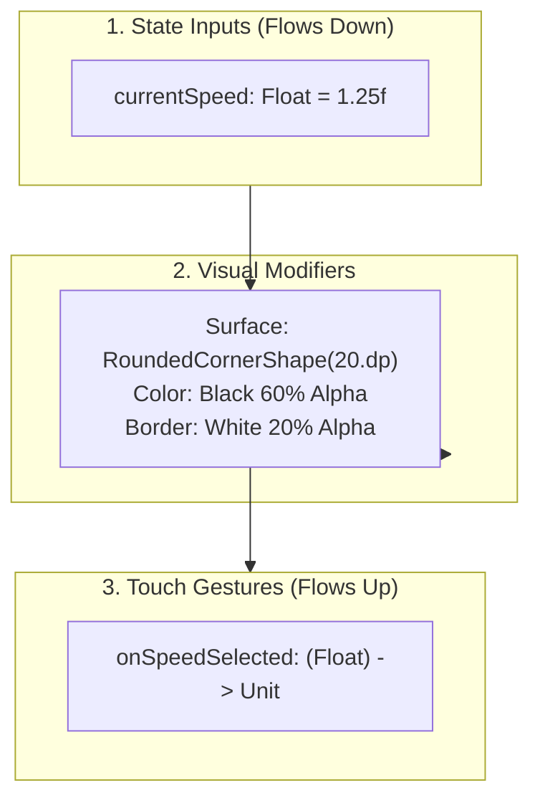

# 🎨 Blueprint: Building a Custom Video Component


In this lesson, you will learn how to design, draw, and wire a brand new custom UI component from a blank file in Jetpack Compose.

---

## 👶 1. The Beginner Analogy: Designing a Custom Dashboard Gauge

Instead of buying a standard plastic speedometer, you want to design a sleek, glowing digital tachometer for your car:
1. **The Inputs (What it displays):** Current playback speed (e.g. `1.25x`).
2. **The Controls (What happens when touched):** Tapping or dragging it changes the speed between `0.5x` and `3.0x`.
3. **The Styling:** Dark semi-transparent pill, rounded corners, subtle glass border.

---

## 📊 2. Visual Architecture: Component Anatomy



---

## 🔍 3. Complete Code Tutorial: Building `FloatingSpeedBadge.kt`

Here is a complete, copy-paste ready custom component:

```kotlin
package xyz.mpv.rex.ui.player.controls.components

import androidx.compose.animation.core.animateFloatAsState
import androidx.compose.animation.core.tween
import androidx.compose.foundation.background
import androidx.compose.foundation.border
import androidx.compose.foundation.clickable
import androidx.compose.foundation.layout.*
import androidx.compose.foundation.shape.RoundedCornerShape
import androidx.compose.material3.MaterialTheme
import androidx.compose.material3.Text
import androidx.compose.runtime.*
import androidx.compose.ui.Alignment
import androidx.compose.ui.Modifier
import androidx.compose.ui.draw.clip
import androidx.compose.ui.draw.scale
import androidx.compose.ui.graphics.Color
import androidx.compose.ui.unit.dp
import androidx.compose.ui.unit.sp

@Composable
fun FloatingSpeedBadge(
    currentSpeed: Float,
    onSpeedSelected: (Float) -> Unit,
    modifier: Modifier = Modifier
) {
    var isPressed by remember { mutableStateOf(false) }

    // Smooth bounce scale animation when tapped:
    val scale by animateFloatAsState(
        targetValue = if (isPressed) 0.92f else 1.0f,
        animationSpec = tween(durationMillis = 100),
        label = "BadgeScale"
    )

    Box(
        modifier = modifier
            .scale(scale)
            .clip(RoundedCornerShape(16.dp))
            .background(Color.Black.copy(alpha = 0.55f))
            .border(1.dp, Color.White.copy(alpha = 0.25f), RoundedCornerShape(16.dp))
            .clickable {
                isPressed = true
                // Cycle speed: 1.0x ➔ 1.25x ➔ 1.5x ➔ 2.0x ➔ 1.0x
                val nextSpeed = when (currentSpeed) {
                    1.0f -> 1.25f
                    1.25f -> 1.5f
                    1.5f -> 2.0f
                    else -> 1.0f
                }
                onSpeedSelected(nextSpeed)
                isPressed = false
            }
            .padding(horizontal = 12.dp, vertical = 6.dp),
        contentAlignment = Alignment.Center
    ) {
        Text(
            text = "${String.format("%.2f", currentSpeed)}x",
            color = if (currentSpeed != 1.0f) MaterialTheme.colorScheme.primary else Color.White,
            fontSize = 13.sp,
            fontWeight = androidx.compose.ui.text.font.FontWeight.SemiBold
        )
    }
}
```

---

## ⚡ 4. How to Wire It into PlayerControls

Now that the component exists, embedding it in `PlayerControls.kt` requires only 4 lines:

```kotlin
FloatingSpeedBadge(
    currentSpeed = playbackSpeed,
    onSpeedSelected = { newSpeed ->
        viewModel.setPlaybackSpeed(newSpeed)
    },
    modifier = Modifier.padding(8.dp)
)
```

---

## 🎯 5. Key Takeaways

- [x] Design custom components to be **stateless**: accept state as parameters and emit changes via lambda callbacks.
- [x] Use **`animateFloatAsState`** to give touch feedback (scale/bounce) to custom controls.
- [x] Use **`.clip(RoundedCornerShape)`** followed by **`.background`** to achieve modern frosted-glass pill shapes.
- [x] Decoupled components can be dropped anywhere in your app without touching player engine logic.
