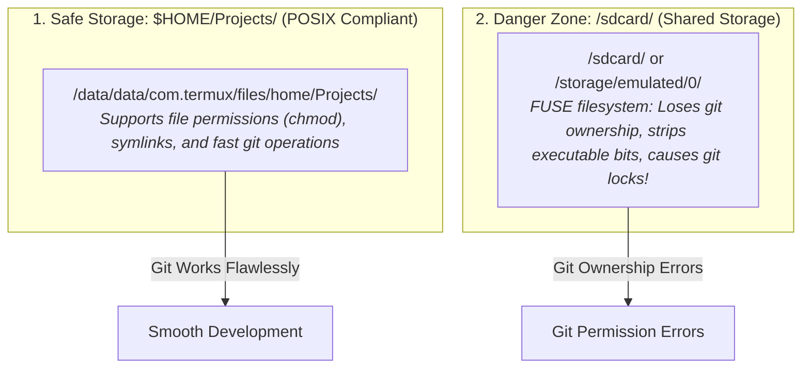

# 📱 Mobile Git & Jujutsu (jj) Workflows


In this lesson, you will learn essential terminal hygiene, storage permission boundaries, and version control workflows using **Git** and **Jujutsu (`jj`)** directly in Termux.

---

## 👶 1. The Beginner Analogy: The Clean Mobile Tool Shed

Working on a phone in Termux is like operating a high-precision workshop inside a compact mobile camper van:
- If you leave tools scattered on the floor (**messy uncommitted files on shared storage**), you trip and break equipment.
- If you rush and press 5 power buttons at once (**chaining build + commit + push in one command**), the generator trips and the work is ruined!

---

## 📊 2. Visual Architecture: Storage Boundaries in Android



---

## ⚠️ 3. The 3 Golden Rules of Mobile Android Development

### Rule 1: Never Clone Repositories onto `/sdcard`
Android shared storage (`/sdcard`) does not support standard Linux POSIX file permissions:
- Executable scripts (`./gradlew`) lose their run permissions (`chmod +x`).
- Git marks every file as modified because file mode changes from `644` to `755`.
- **Always keep your repositories in `$HOME/Projects/`** (e.g. `/root/Projects/mpvRex`).

---

### Rule 2: Never Chain Build, Commit, and Push Together!
```bash
# ❌ DANGEROUS ANTI-PATTERN:
./gradlew assembleDebug && git add . && git commit -m "update" && git push
```

**Why this is dangerous:**
1. If the build fails halfway through, an incomplete or broken state might still get committed.
2. If there are untracked secrets (like local keystore files), `git add .` accidentally stages them to GitHub!
3. On mobile, resource exhaustion can stall simultaneous execution.

#### ✅ The Professional Separated Routine:
```bash
# Step 1: Verify compilation succeeds:
./gradlew compileDebugKotlin -I local-env.gradle.kts

# Step 2: Check what files actually changed:
git status -s

# Step 3: Stage ONLY the relevant files:
git add app/src/main/kotlin/xyz/mpv/rex/ui/player/Seekbar.kt

# Step 4: Commit with a meaningful message:
git commit -m "feat(player): add white seekbar styling option"

# Step 5: Push when ready:
git push origin master
```

---

### Rule 3: Always Pass `-I local-env.gradle.kts`
When building in Termux / AndroidIDE:
- Standard desktop Gradle expects fixed Android SDK paths located in `/opt` or `C:\Users`.
- Passing **`-I local-env.gradle.kts`** injects local build-tools configurations and keystore credentials automatically.

---

## 🎯 4. Key Takeaways

- [x] Keep all git repositories inside **`$HOME/Projects/`** to preserve Linux POSIX permissions.
- [x] Never develop on **`/sdcard`**; it causes file ownership conflicts and broken symlinks.
- [x] Run compilation, git staging, committing, and pushing as **separate, intentional steps**.
- [x] Always append **`-I local-env.gradle.kts`** to Gradle commands when developing on mobile.
