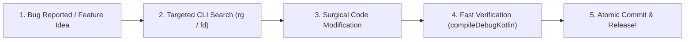

# 👑 From Learner to Maintainer

Congratulations on completing the entire curriculum! In this final lesson, you will learn how to transition from a student into a confident **project maintainer** capable of reviewing pull requests, upgrading dependencies, and shipping updates to **mpvRex**.

---

## 👶 1. The Beginner Analogy: Taking the Captain's Wheel

When you first opened this repository, you felt like a passenger boarding an enormous ocean liner with thousands of confusing pipes and valves.

Today, you know:
- Where the fuel lines run (Gradle & Dependencies).
- How the steering wheel turns the rudder (Compose UI ➔ ViewModel ➔ JNI).
- How the twin engines produce propulsion (`libmpv` & MediaCodec hardware decoders).
- How to navigate storms (Logcat, Crash Handlers, and defensive fallbacks).

You are no longer just a passenger. **You are the captain of the ship!**

---

## 📊 2. Visual Architecture: The Maintainer's Lifecycle

---

## 🛠️ 3. The 4 Golden Habits of a Great Maintainer

### 1. Make Small, Surgical Changes
Never rewrite 10 files at once when a 2-line edit achieves the same result. The best pull requests are 15 lines long, easy to review, and impossible to break.

---

### 2. Upgrading Dependencies Safely
Once every few months, update your version catalog (`gradle/libs.versions.toml`):
- Bump Kotlin and Compose BOM versions.
- Test compilation with `./gradlew compileDebugKotlin -I local-env.gradle.kts`.
- If an API changed or was deprecated, read the compiler warning and update the function name.

---

### 3. Maintain Your Second Brain (`dev-likeAPro`)
Whenever you discover an obscure bug or learn a tricky Android edge-case:
- **Write it down in this wiki!**
- Human memory fades, but documentation remains forever. Your future self will thank you.

---

### 4. Code with Confidence
Do not be intimidated by complex C libraries or large repositories. Every massive software project in the world is simply a collection of simple Kotlin functions, data classes, and state loops working together.

You have the tools, the mental models, and the knowledge. **Go build amazing things! 🚀**

---

## 🎯 4. Graduation Checklist

- [x] Mastered Android APK and runtime fundamentals (ART & DEX).
- [x] Mastered modern declarative UI with Jetpack Compose (Layouts, Modifiers, Canvas, Theming).
- [x] Mastered Architecture, ViewModels, Coroutines, and reactive StateFlows.
- [x] Understood JNI, native `libmpv` integration, and video surface pipelines.
- [x] Equipped with high-speed CLI search tools and defensive coding patterns.
- [x] Ready to maintain **mpvRex** and create brand-new standalone applications!
