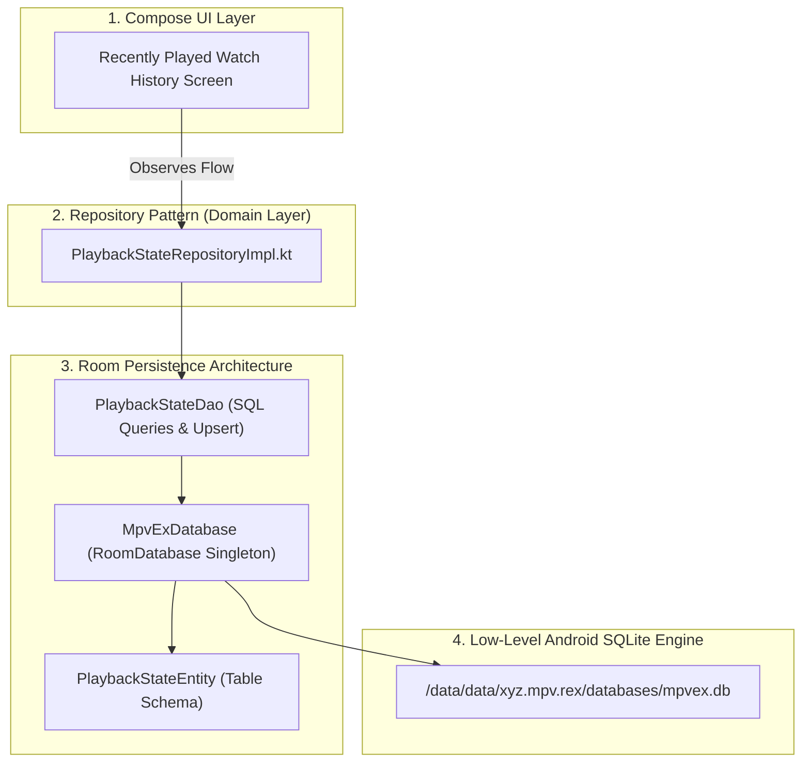

# 🗄️ The Room Database Masterclass (Entities, DAOs & Caching)


In this lesson, you will learn how modern Android apps store massive amounts of structured data (watch history, resume playback timestamps, video metadata, and playlists) using Google's **Room Persistence Library** over SQLite.

---

## 👶 1. The Beginner Analogy: The Spreadsheet & The Automated Librarian

While **SharedPreferences / DataStore** is a small notepad for simple toggles (like `white_seekbar = true`), a **Database** is an enormous digital spreadsheet library:
1. **The Tables (`@Entity`):** Organized spreadsheets with labeled columns (`mediaTitle`, `lastPositionSeconds`, `playbackSpeed`, `audioDelay`).
2. **The Librarian (`@Dao` - Data Access Object):** A trained assistant who retrieves, updates, or deletes rows using SQL queries.
3. **The Reactive Delivery (`Flow<List<T>>`):** Whenever a new movie is watched, the librarian automatically drops an updated list onto your desk without you having to ask twice!

---

## 📊 2. Visual Architecture: The Room Database Pipeline in mpvRex



---

## 🔍 3. The 3 Core Components of Room

### 📋 A. The Entity (`@Entity` - Defining the Table Schema)
An entity represents a single table in SQLite. Each property in the data class is a column:

```kotlin
package xyz.mpv.rex.database.entities

import androidx.room.Entity
import androidx.room.PrimaryKey

@Entity
data class PlaybackStateEntity(
    // 1. Primary Key: Unique identifier for each row
    @PrimaryKey val mediaTitle: String,
    
    // 2. Table columns:
    val lastPosition: Int,             // Resume timestamp in seconds
    val playbackSpeed: Double,         // Saved speed (e.g. 1.25x)
    val sid: Int,                      // Subtitle track ID
    val aid: Int,                      // Audio track ID
    val subDelay: Int,                 // Subtitle delay offset
    val audioDelay: Int,               // Audio delay offset
    val hasBeenWatched: Boolean = false
)
```

---

### 🔍 B. The DAO (`@Dao` - Data Access Object)
The DAO is where you define methods to read and write database records using SQL annotations:

```kotlin
package xyz.mpv.rex.database.dao

import androidx.room.Dao
import androidx.room.Query
import androidx.room.Upsert
import kotlinx.coroutines.flow.Flow
import xyz.mpv.rex.database.entities.PlaybackStateEntity

@Dao
interface PlaybackStateDao {
    // 1. Upsert: Inserts a new row or updates it if mediaTitle already exists!
    @Upsert
    suspend fun upsert(playbackState: PlaybackStateEntity)

    // 2. Query a single video record by title:
    @Query("SELECT * FROM PlaybackStateEntity WHERE mediaTitle = :mediaTitle LIMIT 1")
    suspend fun getVideoDataByTitle(mediaTitle: String): PlaybackStateEntity?

    // 3. Delete a record when user clears history:
    @Query("DELETE FROM PlaybackStateEntity WHERE mediaTitle = :mediaTitle")
    suspend fun deleteByTitle(mediaTitle: String)

    // 4. Reactive Stream: Emits a fresh list whenever ANY row changes in SQLite!
    @Query("SELECT * FROM PlaybackStateEntity")
    fun observeAllPlaybackStates(): Flow<List<PlaybackStateEntity>>
}
```

> [!TIP] The Power of `@Upsert`
> In older SQLite, you had to check if a row existed first (`SELECT`), then decide between `INSERT` and `UPDATE`. Room's modern **`@Upsert`** does this in a single atomic database instruction!

---

### 🏛️ C. The Database Class (`@Database`)
The main access point connecting your DAOs to SQLite:

```kotlin
@Database(
    entities = [
        PlaybackStateEntity::class,
        RecentlyPlayedEntity::class,
        VideoMetadataEntity::class,
        PlaylistEntity::class
    ],
    version = 18,
    exportSchema = true
)
abstract class MpvExDatabase : RoomDatabase() {
    abstract fun videoDataDao(): PlaybackStateDao
    abstract fun recentlyPlayedDao(): RecentlyPlayedDao
    abstract fun videoMetadataDao(): VideoMetadataDao
}
```

---

## ⚡ 4. Real-World Connection: How mpvRex Uses Room

In `mpvRex`, Room powers three critical subsystems:

### 1. Resume Playback ("Pick Up Where You Left Off")
When you exit a movie at minute `45:20`:
- `PlaybackStateRepositoryImpl` saves `PlaybackStateEntity(mediaTitle="Movie.mkv", lastPosition=2720)`.
- When you open the movie next week, `mpvRex` queries `getVideoDataByTitle()`, detects `lastPosition = 2720`, and prompts: *"Resume from 45:20?"*

### 2. High-Speed Video Metadata Caching (`VideoMetadataDao`)
Scanning a folder with 1,000 video files to read their durations and resolutions via MediaCodec can take 30+ seconds.
- `mpvRex` caches durations, codecs, and dimensions into `VideoMetadataEntity` using file checksums.
- The next time you open the folder, the file list displays instantly in **under 50 milliseconds**!

### 3. Custom Playlists & Play Count History
`PlaylistDao` and `MediaPlayCountDao` track which videos you watch most often and preserve custom user-curated playlists.

---

## 🎯 5. Key Takeaways

- [x] Use **Room** over SQLite for structured, relational data (history, resume timestamps, playlists).
- [x] **`@Entity`** defines table structures and column types; **`@PrimaryKey`** uniquely identifies each row.
- [x] **`@Dao`** defines asynchronous queries (`suspend`) and reactive streams (`Flow<List<T>>`).
- [x] **`@Upsert`** automatically inserts new rows or updates existing ones.
- [x] Caching media metadata in Room prevents slow disk scans and keeps file browsers fast and responsive.
