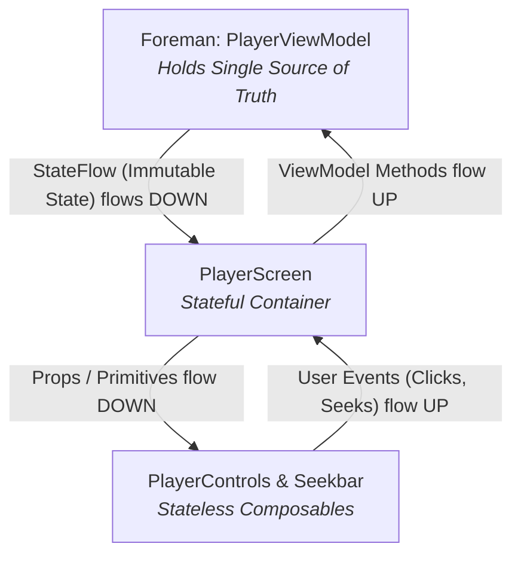
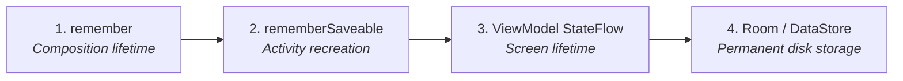

# 🎨 Jetpack Compose UI & State Architecture

In modern Android development, **Jetpack Compose** completely replaces the old imperative View system (`findViewById`, XML layouts). However, without clear architectural discipline, Compose apps quickly become unmaintainable spaghetti code where UI components mutate state directly and trigger endless, wasteful recompositions.

This guide details the **production-grade state architecture** used in scalable Android applications like **mpvRex**.

---

## 1. The Core Law: Unidirectional Data Flow (UDF)

In Compose architecture, data must **never** travel in two directions simultaneously. It follows a strict, one-way loop:



### The 2 Immutable Rules of UDF:
1. **State Flows DOWN**: UI components only receive read-only data (immutable data classes or primitives).
2. **Events Flow UP**: UI components never modify variables directly. When a user taps a button or drags a slider, the component fires a lambda event upwards to the owner of that state.

---

## 2. The 4 Layers of State Lifetimes

Not all state is created equal. Storing simple UI animation state in a database is just as harmful as storing critical user settings in a temporary composable variable.

| State Tier | Where It Lives | What It Survives | What It Resets On | Real-World Example |
| :--- | :--- | :--- | :--- | :--- |
| **1. Ephemeral UI State** | `remember { mutableStateOf() }` | Recompositions | Screen exit, rotation | Tooltip visibility, ripple effect, drag offset |
| **2. Restorable UI State** | `rememberSaveable { mutableStateOf() }` | Rotation, process death | Navigating completely away | Text field input, scroll position of a drawer |
| **3. Business / Screen State** | `ViewModel` (`StateFlow`) | Screen rotation, navigation | ViewModel clearance (exit screen) | Current track title, duration, volume, playback speed |
| **4. Persistent State** | `DataStore` / `Room` / `Preferences` | App restart, phone reboot | Cache clearing, app uninstall | User theme, white seekbar preference, playback history |



---

## 3. State Hoisting (Stateless vs Stateful Composables)

**State Hoisting** is the architectural pattern of moving state up to make a composable **stateless**, reusable, and testable.

### ❌ Anti-Pattern: Tight Coupling (Hard to Test, Broken Previews)
Here, the Seekbar directly injects the `PlayerViewModel`. It cannot be previewed in Android Studio, cannot be tested without a mock ViewModel, and cannot be reused in another screen:

```kotlin
// BAD: Coupled directly to ViewModel
@Composable
fun VideoSeekbar(viewModel: PlayerViewModel = koinViewModel()) {
    val progress by viewModel.progress.collectAsState()
    Slider(
        value = progress,
        onValueChange = { viewModel.seekTo(it) } // Modifying directly
    )
}
```

### ✅ Clean Architecture: State Hoisted (Stateless Component)
Separate the component into a **Stateful Container** and a **Stateless Presentation**:

```kotlin
// 1. STATEFUL CONTAINER (Boundary Layer)
@Composable
fun VideoSeekbarRoute(viewModel: PlayerViewModel = koinViewModel()) {
    val progress by viewModel.progress.collectAsState()
    
    VideoSeekbar(
        progress = progress,
        onSeek = viewModel::seekTo
    )
}

// 2. STATELESS PRESENTATION (100% Reusable, Easy to Preview & Test)
@Composable
fun VideoSeekbar(
    progress: Float,
    onSeek: (Float) -> Unit,
    modifier: Modifier = Modifier
) {
    Slider(
        value = progress,
        onValueChange = onSeek,
        modifier = modifier
    )
}
```

---

## 4. Structuring Screen UI State: The Single State Object

Avoid declaring 10 separate `MutableStateFlow`s in your ViewModel for a single screen. This creates race conditions where the UI updates piecemeal.

### Preferred Pattern: Immutable UI State Data Class
Group related screen state into a single immutable data class:

```kotlin
data class PlayerUiState(
    val title: String = "",
    val isPlaying: Boolean = false,
    val positionMs: Long = 0L,
    val durationMs: Long = 0L,
    val isControlsVisible: Boolean = true,
    val isBuffering: Boolean = false,
    val errorMessage: String? = null
)
```

In your ViewModel:
```kotlin
class PlayerViewModel(
    private val playbackManager: PlaybackManager
) : ViewModel() {

    private val _uiState = MutableStateFlow(PlayerUiState())
    val uiState: StateFlow<PlayerUiState> = _uiState.asStateFlow()

    fun togglePlayPause() {
        _uiState.update { current ->
            current.copy(isPlaying = !current.isPlaying)
        }
        playbackManager.togglePlayPause()
    }
}
```

In your Composable:
```kotlin
@Composable
fun PlayerScreen(viewModel: PlayerViewModel = koinViewModel()) {
    val state by viewModel.uiState.collectAsStateWithLifecycle()

    if (state.isBuffering) {
        LoadingSpinner()
    }

    PlayerControls(
        isPlaying = state.isPlaying,
        onPlayPauseClick = viewModel::togglePlayPause
    )
}
```

---

## 5. Recomposition Traps & Performance Rules

Compose recomposes functions whenever their input parameters change. To keep 60/120 FPS playback buttery smooth, follow these 3 performance guidelines:

### Rule 1: Defer State Reads with Lambdas
If state changes rapidly (e.g. video position updating 30 times a second), do **not** read it at the parent level if only a child modifier needs it.

```kotlin
// BAD: Parent recomposes 30 times every second!
val offset by viewModel.sliderOffset.collectAsState()
Box(modifier = Modifier.offset(x = offset.dp, y = 0.dp))

// GOOD: Zero recompositions! Only the Layout phase runs.
Box(modifier = Modifier.offset { IntOffset(x = viewModel.sliderOffset.value.roundToInt(), y = 0) })
```

### Rule 2: Keep Modifier Chains Canonical
Pass `modifier: Modifier = Modifier` as the first optional parameter of every custom Composable, and chain outwards from general to specific.

### Rule 3: Use `collectAsStateWithLifecycle()`
Never use raw `.collectAsState()` in production UI screens. Use `collectAsStateWithLifecycle()` from `androidx.lifecycle:lifecycle-runtime-compose`. It automatically cancels Flow collection when the app is in the background, saving phone battery and CPU cycles.

---

## 🎯 Architecture Checklist for Compose Features

Before committing any Compose UI code:
- [ ] Is all mutable state owned by a ViewModel or elevated container?
- [ ] Are presentation Composables stateless (taking data and emitting lambda events)?
- [ ] Does screen state live in a single unified `UiState` data class?
- [ ] Are fast-changing values read inside layout/draw lambda blocks rather than composition?
- [ ] Is Flow collection lifecycle-aware?
