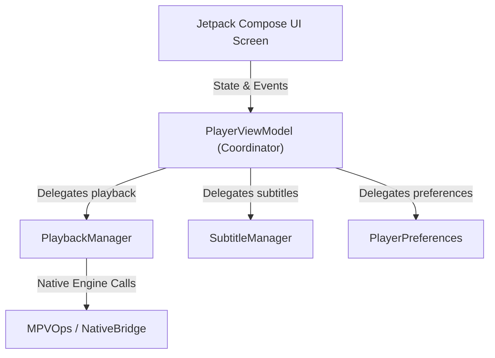

# 🏗️ Ops / Manager Architectural Pattern

A clean, decoupled architectural standard for Android/Kotlin projects that prevents ViewModels and UI layers from becoming massive god-objects.

---

## 📐 Architecture Principles

### 1. ViewModel as Coordinator
- `ViewModel` does not contain core business logic, media scanning, or raw player engine commands.
- It holds UI state (`StateFlow`) and delegates operations to specialized, decoupled Managers.

### 2. Dedicated Managers
- **PlaybackManager:** Handles media playback state, Seeking, Pausing, Buffering.
- **SubtitleManager:** Handles track switching, subtitle parsing, font loading.
- **HistoryManager:** Manages position history and database updates.

### 3. Single Source of Truth
- Media discovery and file system scanning must use dedicated scanners (`CoreMediaScanner` / `FileSystemOps`) rather than ad-hoc file listing in UI components.
