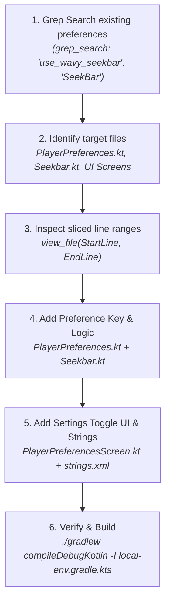

# 🔍 Code Search Masterclass: Finding Things Like a Pro

Finding files, functions, variables, and UI elements quickly in large codebases is one of the most critical skills in software development. This guide documents the exact strategies, tools (`ripgrep`, `find`, `git grep`), and AI-assisted workflows used to navigate and inspect complex projects efficiently.

---

## 🎯 The Core Searching Mindset

> **Golden Rule:** *Never infer implementation details, variable names, or file paths without inspecting the authoritative source.*

When exploring an unfamiliar codebase or adding a feature:
1. **Start Wide, Narrow Down Fast:** Use text-based pattern searches (`grep`/`ripgrep`) to identify file candidates.
2. **Filter Out Noise:** Exclude build outputs (`build/`, `.git/`, `node_modules/`, `.gradle/`).
3. **Inspect Precise Slices:** View line ranges around target symbols rather than loading entire files.
4. **Follow the Data Flow:** Trace from UI components down to state managers, ViewModels, and preferences.

---

## ⚡ Tool 1: `ripgrep` (`rg`) / `grep_search` — Lightning-Fast Text Search

`ripgrep` (or `rg`) is the gold standard command-line tool for searching code. It is multithreaded, respects `.gitignore`, and is blindingly fast.

### 1. Basic Text Search
Search for an exact string in a directory:
```bash
rg "use_wavy_seekbar" /path/to/project
```

### 2. Case-Insensitive Search (`-i`)
When you aren't sure of exact casing (e.g. `SeekBar` vs `seekbar` vs `SEEKBAR`):
```bash
rg -i "seekbar" app/src/main/kotlin
```

### 3. Filter by File Extension or Glob (`-g`)
Limit search to specific file types or exclude heavy directories:
```bash
# Search only Kotlin files
rg "SeekbarStyle" -g "*.kt"

# Search Kotlin files, excluding build directory
rg "playerPreferences" -g "*.kt" -g "!**/build/**"

# Search XML resource files
rg "pref_player" -g "*.xml"
```

### 4. Regular Expression Search (`-e`)
Find function definitions, variable declarations, or annotations:
```bash
# Find preference variable declarations in Kotlin
rg -e "val \w+Preference" -g "*.kt"

# Find Composable functions starting with 'Player'
rg -e "@Composable\s+fun Player\w+" -g "*.kt"
```

### 5. Display Line Numbers & Context (`-n`, `-C`)
Include context lines before (`-B`) and after (`-A`) or around (`-C`) the match:
```bash
# Display 3 lines of context around matches
rg -n -C 3 "white_seekbar" app/src/main/
```

### 6. Only Output Matching File Names (`-l`)
When you just want a list of files to inspect:
```bash
rg -l "PlayerPreferences" app/src/main/kotlin
```

---

## 📁 Tool 2: `find` & `fd` — Locating Files & Directories

Use `find` when searching for files by name, extension, depth, or modification date.

### 1. Find Files by Name Pattern
```bash
# Find all Kotlin files matching *Preferences*
find app/src/main -type f -name "*Preferences*.kt"
```

### 2. Exclude Heavy Build Directories (`-prune`)
```bash
find . -path "*/build/*" -prune -o -type f -name "*.kt" -print
```

### 3. Find Recently Modified Files
Find files modified in the last 24 hours (useful when debugging active work):
```bash
find app/src/main -mtime -1 -type f
```

---

## 📜 Tool 3: `git grep` & `git log` — Historical Code Search

### 1. `git grep` (Fastest Search inside Git Repos)
Searches tracked files without touching untracked or ignored files:
```bash
git grep -n "SeekbarStyle"
git grep -i -n "white_seekbar"
```

### 2. `git log -S` (Pickaxe Search: Track Symbol Addition/Deletion)
Find commits where a specific string was added or removed:
```bash
git log -S "whiteSeekBar" -p
```

### 3. `git log -G` (Regex Search in Commit Diffs)
Find commits where lines matching a regex changed:
```bash
git log -G "val whiteSeekBar" -p
```

### 4. Trace Line Range History (`git log -L`)
Trace how a specific block of lines in a file evolved over time:
```bash
git log -L 65,75:app/src/main/kotlin/xyz/mpv/rex/preferences/PlayerPreferences.kt
```

---

## 🤖 Tool 4: AI Agent Search Tools

When working inside Antigravity / Gemini CLI:

| Tool | Purpose | Best Practice |
| :--- | :--- | :--- |
| `grep_search` | Ripgrep-powered code pattern matching | Pass `Includes: ["*.kt"]` and `MatchPerLine: true` |
| `list_dir` | Directory layout exploration | Inspect package directory structures |
| `view_file` | Reading specific code files | Pass `StartLine` and `EndLine` slices to save context |
| `run_command` | Running terminal commands | Always include required environment flags (`-I local-env.gradle.kts`) |

---

## 🧠 Real-World Case Study: Adding `white_seekbar` in mpvRex

Here is the exact step-by-step methodology used to add a toggle setting for making the video progress bar white:



### Steps Executed:
1. **Search for Precedents:** Ran `grep_search` for `use_wavy_seekbar` and `SeekbarStyle` to locate existing preference definitions and UI screens.
2. **Pinpoint Source Files:**
   - Preference model: `PlayerPreferences.kt`
   - Rendering logic: `Seekbar.kt` (`SquigglySeekbar` & `StandardSeekbar`)
   - Preferences UI: `PlayerControlsPreferencesScreen.kt` & `PlayerPreferencesScreen.kt`
   - Strings resource: `strings.xml`
   - Search index: `SearchablePreference.kt`
3. **Execute Edits:** Added `val whiteSeekBar = preferenceStore.getBoolean("white_seekbar", false)` and updated `primaryColor` in `Seekbar.kt` to evaluate `Color.White` when enabled.
4. **Compile Verification:** Ran `./gradlew compileDebugKotlin -I local-env.gradle.kts`.

---

## 📊 Quick Reference Cheat Sheet

| Task | Command |
| :--- | :--- |
| **Search text in files** | `rg "query" -g "*.kt"` |
| **Case-insensitive search** | `rg -i "query"` |
| **Search regex pattern** | `rg -e "fun \w+View"` |
| **Find file by name** | `find . -name "*ViewModel.kt"` |
| **Fast git search** | `git grep -n "query"` |
| **Find commit that added symbol** | `git log -S "symbol_name" -p` |
| **View file slice in AGY** | `view_file(AbsolutePath, StartLine, EndLine)` |

---
*Created for dev-likeAPro portal.*
