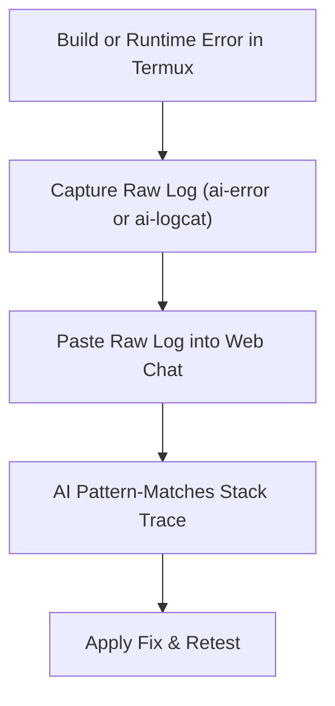

# 🧹 Chat Session Hygiene & The Error Feedback Loop

Two of the biggest mistakes developers make when acting as a manual AI harness are:
1. **Keeping a single conversation open for days** until the AI becomes confused, slow, and hallucinates obsolete code.
2. **Paraphrasing errors in English** instead of pasting the raw stack trace.

In this guide, you will learn the rules of **Session Hygiene** and how to run a high-precision **Error Feedback Loop**.

---

## 🚫 1. The Context Degradation Trap: Why Long Chats Die

As a web chat grows past 20–30 messages, three things happen inside the LLM:
1. **Attention Dispersion:** The model struggles to remember whether a function definition was from yesterday or today.
2. **Context Poisoning:** If the AI suggested a buggy approach in message #4 that you abandoned, it will keep trying to fix or reference that obsolete code in message #25!
3. **Response Sluggishness:** Browsers slow down rendering massive chat DOM trees on mobile phones.


### The Golden Rule: One Task Per Chat
- **Task A (Add Setting Toggle):** Open new chat -> Paste `AGENTS.md` -> Implement setting -> Verify build -> Commit -> **Close chat**.
- **Task B (Fix Logcat Crash):** Open new chat -> Paste `AGENTS.md` -> Paste crash log -> Fix crash -> Commit -> **Close chat**.

Starting fresh takes 3 seconds and guarantees 100% sharp attention from the model.

---

## 🔁 2. The Error Feedback Loop: How Agents Actually Debug

When an automated agent (like Antigravity or Cline) runs a command and it fails, it does **not** interpret the error. It feeds the raw stdout and stderr directly back into the LLM context window.



---

## ❌ Bad Feedback vs. ✅ Good Feedback

### The Wrong Way (Human Paraphrasing):
> *"Hey, it crashed with a null pointer exception on the playback controller. What should I do?"*

**Why this fails:**
- Which variable was null?
- Was it in `onCreate`, `onResume`, or an asynchronous Coroutine?
- What was the line number in the stack frame?
- The AI has to guess, giving you generic, useless advice.

---

### The Right Way (Raw Log Injection):
> *"Here is the raw Logcat crash dump from Termux:"*

````text
FATAL EXCEPTION: main
Process: xyz.mpv.rex, PID: 14210
java.lang.NullPointerException: Attempt to invoke virtual method 'void xyz.mpv.rex.ui.player.controls.ControlsOverlay.show()' on a null object reference
    at xyz.mpv.rex.ui.player.PlayerActivity.updateControlsVisibility(PlayerActivity.kt:182)
    at xyz.mpv.rex.ui.player.PlayerActivity.access$updateControlsVisibility(PlayerActivity.kt:42)
    at xyz.mpv.rex.ui.player.PlayerActivity$initObservers$1.invokeSuspend(PlayerActivity.kt:98)
````

**Why this succeeds instantly:**
1. The AI reads line 182 in `PlayerActivity.kt`.
2. It sees `ControlsOverlay` was null when called.
3. It immediately diagnoses that `updateControlsVisibility` was called **before** `setContentView()` or Compose initialization completed!
4. It provides the exact null-safe check (`controlsOverlay?.show()`) in 5 seconds.

---

## 🛠️ The 3-Part Error Prompt Structure

Whenever you encounter a compiler error or crash, use this standard structure:

````markdown
### 1. ACTION TAKEN:
Ran `./gradlew compileDebugKotlin` in Termux.

### 2. RAW ERROR OUTPUT:
```text
[PASTE EXACT TERMINAL OUTPUT HERE]
```

### 3. SURROUNDING CODE:
File: `app/src/main/kotlin/xyz/mpv/rex/ui/player/PlayerActivity.kt` (Lines 175-190)
```kotlin
[PASTE CODE BLOCK]
```

Please provide a Search/Replace block to fix this compiler error.
````
