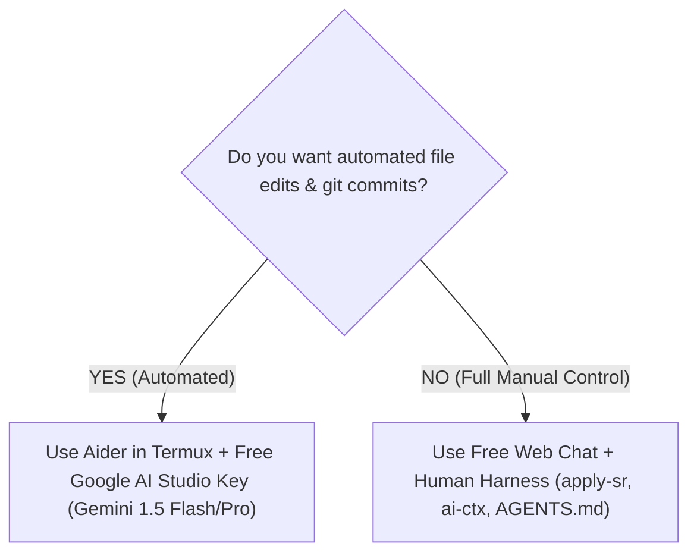

# 🤖 Free & Low-Cost CLI Harness Alternatives for Termux

Before going 100% manual, there is an important industry secret every developer should know:

> **You do NOT need a paid Gemini Pro or Claude subscription to use automated coding agents.**

Agent harnesses (like **Aider** or **OpenCode**) are decoupled from the models they run. They can connect to **free API keys**, open-source models, or pay-as-you-go providers that cost pennies a month.

In this guide, you will learn how to run a real automated coding agent inside **Termux** using 100% free API tiers.

---

## 🔑 1. The Best Kept Secret: Google AI Studio (Free Tier)

Most users pay $20/month for the Gemini web subscription without realizing that Google provides **free API keys** through [Google AI Studio](https://aistudio.google.com/):

| Feature | Gemini Web Subscription | Google AI Studio Free API |
| :--- | :--- | :--- |
| **Cost** | $20 / month | **$0.00 (Free)** |
| **Model** | Gemini 1.5 Pro | **Gemini 1.5 Pro & Gemini 1.5 Flash** |
| **Context Window** | ~1M tokens | **Up to 2,000,000 tokens** |
| **Rate Limit** | Capped | **15 Requests / Minute (RPM) & 1M tokens/min** |
| **CLI / Agent Support** | No direct API | **Yes (Standard API key)** |

### How to Get Your Free Key:
1. Go to [aistudio.google.com](https://aistudio.google.com/) on your browser.
2. Sign in with any standard Google account.
3. Click **Get API key** -> **Create API key**.
4. Copy your key.

---

## ⚡ 2. Running Aider in Termux (Automated Agent for Free)

**Aider** is the industry standard CLI coding agent. It automatically reads your files, writes search/replace blocks, runs tests, and creates git commits for you—directly inside Termux!

### Installation in Termux:
```bash
# 1. Install Python and dependencies in Termux:
pkg install python python-pip git clang libxml2 libxslt
pip install aider-chat
```

### Running Aider with your Free Google AI Studio Key:
```bash
# 2. Export your free API key:
export GEMINI_API_KEY="your-free-key-from-ai-studio"

# 3. Launch Aider in your project folder:
cd ~/Projects/mpvRex
aider --model gemini/gemini-1.5-flash
```

*(You can also use `--model gemini/gemini-1.5-pro` for complex refactoring!)*

### What Aider Does Automatically in Termux:
- You type: `Add a new toggle for hardware decoding in SettingsScreen.kt`.
- Aider reads `SettingsScreen.kt`.
- Aider generates the search/replace block.
- Aider applies the edit to the file on disk.
- Aider runs `git commit` with an automated, descriptive message!

---

## 🚀 3. Other Free & Ultra-Low-Cost API Providers

If you ever exceed Gemini rate limits, you can plug these alternatives into your CLI agent:

### A. Groq (100% Free Tier)
- **Website:** [groq.com](https://groq.com/)
- **Offer:** Completely free API access to **Llama 3.3 70B** and **DeepSeek R1**.
- **Speed:** 500+ tokens per second (the fastest inference engine in the world).
- **Usage with Aider:**
  ```bash
  export GROQ_API_KEY="gsk_..."
  aider --model groq/llama-3.3-70b-versatile
  ```

### B. OpenRouter Free Models
- **Website:** [openrouter.ai](https://openrouter.ai/)
- **Offer:** Free access to models tagged `:free` (e.g. `meta-llama/llama-3.3-70b-instruct:free`, `qwen/qwen-2.5-coder-32b-instruct:free`).

### C. DeepSeek API (Pennies per Month)
- If you ever choose to spend money, DeepSeek V3 costs ~$0.14 per 1,000,000 input tokens. A month of heavy mobile coding typically costs less than **$1.50 total**.

---

## 🧭 Decision Matrix: Manual Harness vs. Free CLI Agent



### Recommendation:
- Keep **both** in your toolkit!
- Use **Aider + Free Gemini Flash API** for rapid, multi-file code refactors and automatic git commits.
- Use the **Manual Human Harness** with web chats (Claude Free / ChatGPT Free) when you want visual reasoning, complex architectural discussions, or when you are on limited data.
