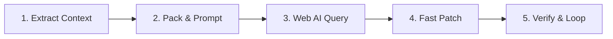

# 🧠 The Human Harness Blueprint: Zero-Cost AI Pair Programming

When you lose access to paid agentic coding harnesses (like Antigravity, Claude Code, or Cursor), you do **not** lose the power of AI coding. 

Instead of an automated binary executing tool calls in the background, **YOU become the harness**—the intelligent human bridge between free web LLMs (ChatGPT Free, Gemini 1.5 Flash/Pro web, Claude Sonnet free web, DeepSeek) and your local project running in **Termux / AndroidIDE**.

---

## 👶 1. The Core Mental Model: What an Agent Harness Actually Does

Automated agent harnesses are not magical. They perform a mechanical 5-step loop:

```mermaid
flowchart TD
    subgraph Automated_Agent["Automated Coding Agent (e.g. Antigravity)"]
        A1["Reads Files via view_file tool"] --> A2["Builds Prompt + Injects Context"]
        A2 --> A3["Sends API Request to Model"]
        A3 --> A4["Parses Tool Calls & Writes Code"]
        A4 --> A5["Runs Build / Terminal Commands"]
        A5 -.->|"Loops on Error"| A1
    end

    subgraph Human_Harness["The Human Harness (YOU + Free Web Chat)"]
        H1["1. You extract context using CLI (rg, cat, git diff)"] --> H2["2. You paste context into Free Web Chat"]
        H2 --> H3["3. Web AI generates unified diff or function"]
        H3 --> H4["4. You apply diff via git apply or editor"]
        H4 --> H5["5. You test build & feed errors back to chat"]
        H5 -.->|"Rapid Iteration"| H1
    end
```



When you understand this loop, you can achieve **95% of an automated agent's coding power with zero subscription costs** using Termux CLI shortcuts!

---

## ⚖️ Automated Harness vs. Human Harness

| Dimension | Automated Agent (Antigravity / Paid) | Human Harness (You + Free Web LLM) |
| :--- | :--- | :--- |
| **Monthly Cost** | $20 – $200+ / month in API fees | **$0.00 (100% Free)** |
| **Context Extraction** | Agent searches blindly with tool calls | **You target exact files in seconds with `rg` / `fd`** |
| **Hallucination Risk** | Agent may edit wrong files silently | **You review every single diff before applying** |
| **File Editing** | Agent overwrites or uses patch tools | **You use `git apply`, `patch -p1`, or AndroidIDE** |
| **Token Limits** | Constrained by API tier credits | **Take advantage of generous free web limits** |
| **Storage Traps** | Can hit Termux `/sdcard` git lockups | **You have total control over terminal environment** |

---

## 🔄 2. The 5-Stage Human-in-the-Loop Protocol

To work at high speed without getting bogged down by manual copy-pasting, follow this standardized 5-stage protocol:



### Stage 1: Precision Context Extraction
- **The Rule:** Never paste an entire 2,000-line file into the chat if you only need to change a 20-line function.
- **The Tool:** Use `sed -n '50,120p' File.kt`, `git diff`, or `rg -C 5` to extract only the pertinent code blocks.

### Stage 2: Prompt Packaging with Strict Constraints
- Free web models love to be conversational, apologize, or write incomplete code (`// ... rest of your code here ...`).
- **The Rule:** Always append **Format Directives** demanding complete drop-in functions or Unified Diffs.

### Stage 3: Web Chat Execution
- Keep separate browser tabs for distinct tasks:
  - **Tab A:** Architecture & design queries.
  - **Tab B:** Fast debugging and compiler error parsing.
  - **Tab C:** Reverse-engineering reference codebases (e.g. `mpvRex`).

### Stage 4: Rapid Application (No Manual Typing)
- **The Rule:** Never retype code by hand on a mobile keyboard!
- Use Termux clipboard tools (`termux-clipboard-get`), `git apply`, or open files in AndroidIDE / Micro.

### Stage 5: Verification & Error Feedback
- Run a targeted Kotlin compilation check:
  ```bash
  ./gradlew compileDebugKotlin -I local-env.gradle.kts
  ```
- If the compiler fails, copy the exact 3-line error message back to the web AI:
  > *"Line 42 failed with Unresolved reference: 'viewModelScope'. Here is my current imports block. Fix it."*

---

## 📚 Complete Guide Series

Explore the dedicated guides in this section to turn your mobile terminal into a professional, zero-cost AI pair-programming workstation:

1. [**The Portable Project Brief (`AGENTS.md`)**](/human-harness/project-brief-agents-md) — The 30-line architecture blueprint to paste into every new chat to eliminate hallucinations.
2. [**High-Speed Context Extraction in Termux**](/human-harness/context-extraction) — Slicing lines with `sed`, finding symbols with `ripgrep`, and copying multi-file context to the Android clipboard.
3. [**Prompt Templates & Directives for Free Web AIs**](/human-harness/prompt-templates) — Battle-tested prompts that stop AI truncation and enforce strict Android coding standards.
4. [**The Search/Replace Block Protocol (Aider Pattern)**](/human-harness/search-replace-blocks) — The gold standard for applying code edits automatically in Termux using `apply-sr.py`.
5. [**Applying AI Code & Diffs in Termux**](/human-harness/patching-and-diffs) — Applying unified diffs with `git apply`, managing temporary scratch branches, and handling truncated responses.
6. [**Chat Session Hygiene & The Error Feedback Loop**](/human-harness/chat-session-hygiene) — The "One Task Per Chat" rule and how to feed raw compiler errors and Logcat crash dumps back to the AI.
7. [**Automating the Middleman: Termux Shell Toolkit**](/human-harness/termux-automation-scripts) — Lightweight bash scripts (`ai-ctx`, `ai-diff`, `ai-patch`, `ai-error`, `ai-logcat`) that automate the loop.
8. [**Free & Low-Cost CLI Harness Alternatives for Termux**](/human-harness/free-cli-harness-alternatives) — Running automated agents like Aider with 100% free Google AI Studio API keys (Gemini 1.5 Flash/Pro) inside Termux!
