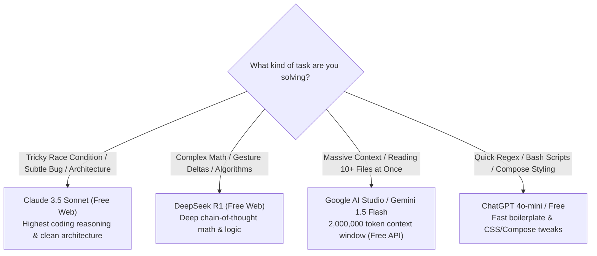
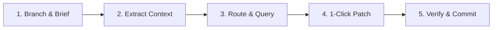

# 🗺️ Code Compression: Skeleton Outlines & Multi-Model Routing

To become a truly world-class **Human Bridge** between your codebase and AI models, you must master the two advanced superpowers that professional automated coding agents use behind the scenes:
1. **Repository Mapping (Skeleton Outlines):** How to feed the AI 5 complex classes at once without pasting thousands of lines of code.
2. **Multi-Model Routing:** How to pick the exact right free AI model for each specific task (debugging vs. architecture vs. UI styling).
3. **The Human Bridge Daily Runbook:** The complete, start-to-finish checklist for every coding session.

---

## 🧩 1. The Dilemma: Context Overflow vs. Missing Dependencies

Suppose you want the AI to write a new `PlaylistDetailViewModel`. This ViewModel must call:
- `PlaylistRepository` (400 lines)
- `RecentlyPlayedRepository` (300 lines)
- `PlaybackStateOps` (500 lines)
- `MediaThumbnailUtils` (350 lines)

If you copy and paste all 4 files completely, you are dumping **1,550 lines of code** into the chat window!
- Free models will slow down or truncate their responses.
- The AI will get distracted by internal implementation details of those classes that it doesn't need to know!

---

## ⚡ 2. The Solution: Interface Skeletons (The Repo Map)

The AI doesn't need to know *how* `PlaylistRepository` writes SQL queries to disk.
It only needs to know **what functions exist, what parameters they accept, and what they return**!

### Comparison:
| Full File (Bloated) | Skeleton Outline (Compressed) |
| :--- | :--- |
| **400 lines** of internal Room queries, try-catch blocks, and SQLite transactions. | **15 lines** of pure function signatures. |
| Consumes 5,000 tokens. | Consumes **120 tokens (97% reduction!)**. |

### The 1-Second Skeleton Extractor:
Add this bash function to your `~/.bashrc` in Ubuntu (or save as `/usr/local/bin/ai-outline`):

```bash
# Add to ~/.bashrc:
outline() {
    local file="$1"
    if [ ! -f "$file" ]; then
        echo "Usage: outline <file.kt>"
        return 1
    fi

    {
        echo "### Class Outline: \`$file\`"
        echo '```kotlin'
        grep -E '^\s*(class|interface|object|enum|sealed|abstract|fun|val|var)\b' "$file" | grep -v 'private '
        echo '```'
    } | clip

    echo "📋 Copied public skeleton outline of $file to Android clipboard!"
}
```

### What gets copied to your clipboard:
When you run `outline app/src/main/kotlin/.../PlaylistRepository.kt`, your clipboard receives:

```kotlin
### Class Outline: `PlaylistRepository.kt`
```kotlin
class PlaylistRepository(private val playlistDao: PlaylistDao) {
    suspend fun getPlaylistById(id: Int): PlaylistEntity?
    fun observeAllPlaylists(): Flow<List<PlaylistEntity>>
    suspend fun addItemsToPlaylist(playlistId: Int, filePaths: List<String>)
    suspend fun reorderItems(playlistId: Int, newOrder: List<Int>)
    suspend fun deletePlaylist(playlistId: Int)
}
```
Now paste this 10-line skeleton into the chat. The AI knows **exactly** what methods to call, without wasting a single token!

---

## 🎯 3. Multi-Model Routing Strategy (Picking the Best Free AI)

As the human bridge, you have the freedom to route different sub-tasks to the model that excels at them:



---

## 📋 4. The Human Bridge Daily Runbook (The Master Checklist)

Print or bookmark this checklist. This is your standardized daily routine:



### ✅ Step 1: Session Initialization (15 seconds)
- [ ] Open Termux in your project directory.
- [ ] Create a scratch branch: `git checkout -b feature/my-new-task`.
- [ ] Copy your project brief: `ctx-brief`.
- [ ] Open a **brand new chat tab** in your browser and paste the brief.

### ✅ Step 2: Context Packaging (30 seconds)
- [ ] Find target file: `rg -l "keyword" app/src/main/`.
- [ ] Extract target file or function: `ai-ctx path/to/File.kt 50 120`.
- [ ] If dependencies exist, extract their skeletons: `outline path/to/Dependency.kt`.
- [ ] Paste into the chat with the Search/Replace prompt directive.

### ✅ Step 3: Model Execution (30 seconds)
- [ ] Let the AI generate Search/Replace blocks.
- [ ] Tap **Copy Code** in the browser.

### ✅ Step 4: Local Application (3 seconds)
- [ ] Switch to Termux.
- [ ] Run: `apply-sr` (or `ai-patch`).
- [ ] Run `git diff` to review the edits with your own eyes.

### ✅ Step 5: Verification & Feedback (30 seconds)
- [ ] Run: `ai-error` (compiles Kotlin).
- [ ] *If compiler errors occur:* Switch to chat and hit Paste (it's already in your clipboard!).
- [ ] Test on device: `./gradlew installDebug -I local-env.gradle.kts`.
- [ ] *If app crashes:* Run `ai-logcat` and paste the crash dump to the AI.

### ✅ Step 6: Commit & Reset (15 seconds)
- [ ] Run: `git commit -m "feat: implement my-new-task"`.
- [ ] Merge or rebase to master.
- [ ] **Close the chat tab** to keep your AI sharp for the next task!

---

## 🏆 Final Verdict: You Are Now the Complete Bridge

By mastering:
1. `AGENTS.md` for baseline context,
2. `outline` for 95% token compression,
3. `apply-sr` for 3-second zero-typing edits,
4. `ai-error` and `ai-logcat` for raw error feedback loops, and
5. Multi-model routing (Claude for logic, Gemini for massive context, DeepSeek for math),

You possess **the full power, rigor, and speed of a $200/month automated coding agent setup—at $0.00 total cost.**
