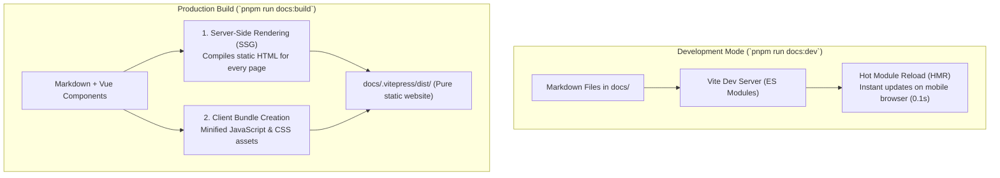
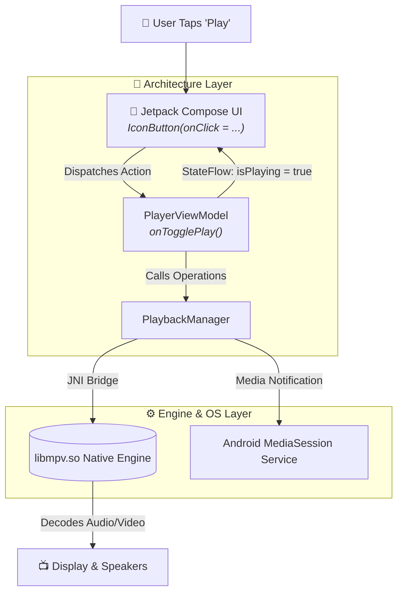

# ⚡ VitePress & Mermaid Architecture Masterclass

This documentation portal (**Dev Like A Pro**) is powered by **VitePress** and **Mermaid**.

This guide explains **everything** about how this project works: its internal mechanics, directory structure, configuration files, multi-sidebar routing, search engine, and how interactive Mermaid diagrams are rendered.

---

## 1. What is VitePress & How Does It Work?

**VitePress** is a modern Static Site Generator (SSG) created by Evan You (the creator of Vue.js) and the Vue core team. It is built directly on top of **Vite** and **Vue 3**.

### How VitePress Operates (Dual Engine):



### Why VitePress is so Fast:
1. **Instant Initial Load**: Every page is pre-rendered to pure static HTML on disk. When you open a link, your browser downloads lightweight HTML immediately.
2. **Single Page Application (SPA) Hydration**: Once loaded, VitePress silently hydrates into a Vue 3 SPA. Clicking subsequent links **never reloads the browser**—it fetches tiny JSON chunks and swaps the content seamlessly!

---

## 2. Project File Anatomy

Here is the exact structure of `/root/Projects/dev-likeAPro`:

```
dev-likeAPro/
├── package.json               # Project dependencies and CLI scripts
├── pnpm-lock.yaml             # Strict dependency lockfile
├── .gitignore                 # Files excluded from git (node_modules, cache, dist)
├── docs/                      # 📁 Content Root (All documentation lives here)
│   ├── index.md               # Home page (/)
│   ├── .vitepress/            # ⚙️ VitePress Configuration Directory
│   │   ├── config.mts         # Main configuration (Nav, Sidebar, Title, Search)
│   │   ├── theme/             # Custom styling & Vue theme overrides
│   │   │   ├── index.mts      # Theme entry point (registers Mermaid renderer)
│   │   │   └── custom.css     # Custom CSS overrides
│   │   ├── cache/             # (Ignored) Vite compiler cache
│   │   └── dist/              # (Ignored) Production build output
│   ├── android-course/        # 📱 Android Course Markdown files
│   ├── workflow/              # 🚀 Developer Workflows & CLI guides
│   ├── architecture/          # 🏗️ Architecture & Pattern docs
│   ├── cheatsheets/           # ⚡ Terminal & Tool cheatsheets
│   └── ai/                    # 🤖 AI & Pair programming guides
```

---

## 3. Configuration Breakdown (`docs/.vitepress/config.mts`)

The file [`docs/.vitepress/config.mts`](file:///root/Projects/dev-likeAPro/docs/.vitepress/config.mts) controls the entire website. Here is how each major feature works:

### A. Clean URLs (`cleanUrls: true`)
```typescript
cleanUrls: true
```
By default, static sites generate URLs like `example.com/android-course/module1.html`.  
With `cleanUrls: true`, VitePress removes the ugly `.html` extension:
- `http://localhost:5173/android-course/module1-basics` instead of `module1-basics.html`.

---

### B. Top Navigation Bar (`nav`)
The navigation links that appear at the top header of every page:

```typescript
nav: [
  { text: 'Home', link: '/' },
  { text: '📱 Android Course', link: '/android-course/' },
  { text: 'Workflows', link: '/workflow/code-search' },
  { text: 'Architecture', link: '/architecture/ops-manager-pattern' },
  { text: 'Cheat Sheets', link: '/cheatsheets/cli-tools' },
  { text: 'AI & Automation', link: '/ai/agent-guide' }
]
```

---

### C. Multi-Sidebar Architecture (`sidebar`)
Instead of one massive sidebar showing 50 files, VitePress supports **Multi-Sidebar mapping**.
When you visit a URL matching a path prefix, the sidebar automatically switches to show only the items relevant to that section:

```typescript
sidebar: {
  // Shown ONLY when browsing inside /android-course/
  '/android-course/': [
    {
      text: '📱 Android Course',
      items: [
        { text: 'Course Overview', link: '/android-course/' },
        { text: 'Lesson 1: The Kotlin Decoder', link: '/android-course/kotlin-decoder' },
        { text: 'Lesson 2: Universal Code Navigation', link: '/android-course/codebase-navigation' },
        { text: 'Lesson 3: The Feature Lifecycle', link: '/android-course/feature-lifecycle' },
        { text: 'Module 1: Compose Fundamentals', link: '/android-course/module1-basics' }
      ]
    }
  ],

  // Shown ONLY when browsing inside /workflow/
  '/workflow/': [
    {
      text: '🚀 Developer Workflows',
      items: [
        { text: 'VitePress & Mermaid Mastery', link: '/workflow/vitepress-mermaid' },
        { text: 'Code Search Masterclass', link: '/workflow/code-search' },
        { text: 'Git & Rebase Mastery', link: '/workflow/git-mastery' },
        { text: 'Termux & Android Dev Setup', link: '/workflow/termux-android-dev' }
      ]
    }
  ]
}
```

---

### D. Offline Local Search Provider
VitePress has an integrated full-text client-side search engine powered by `MiniSearch`:

```typescript
search: {
  provider: 'local',
  options: {
    detailedView: true
  }
}
```
* **No external servers needed**: The entire search index is built at compile time and runs completely inside your browser in under 5ms, even with zero internet connection!

---

## 4. How Mermaid Works in this Project

Mermaid allows developers to write diagrams using plain text code blocks instead of drawing manual images in Photoshop or Figma.

### Why Standard VitePress Doesn't Render Mermaid by Default
VitePress core focuses on speed and minimal bundle sizes. Mermaid is a large library (~20MB), so VitePress leaves diagram rendering to plugins or client theme hooks.

### How `vitepress-mermaid-renderer` Works Behind the Scenes
We installed `vitepress-mermaid-renderer` and configured it inside [`docs/.vitepress/theme/index.mts`](file:///root/Projects/dev-likeAPro/docs/.vitepress/theme/index.mts):

```typescript
import { h, nextTick, watch } from 'vue'
import type { Theme } from 'vitepress'
import DefaultTheme from 'vitepress/theme'
import { useData } from 'vitepress'
import { createMermaidRenderer } from 'vitepress-mermaid-renderer'
import './custom.css'

export default {
  extends: DefaultTheme,
  Layout: () => {
    const { isDark } = useData()
    const initMermaid = () => {
      if (typeof window !== 'undefined') {
        createMermaidRenderer({
          theme: isDark.value ? 'dark' : 'default',
        })
      }
    }
    nextTick(() => initMermaid())
    watch(() => isDark.value, () => initMermaid())
    return h(DefaultTheme.Layout)
  },
} satisfies Theme
```

### What this code does:
1. **Client-Safe Execution (`typeof window !== 'undefined'`)**: Ensures Mermaid only executes in the browser, preventing server-side build crashes.
2. **DOM Scan**: When a page renders, `createMermaidRenderer` scans the HTML for `<pre class="language-mermaid">` blocks and transforms them into interactive SVG diagrams.
3. **Theme Synchronization (`watch(() => isDark.value)`)**: When you toggle the light/dark mode switch in the header, Vue triggers `initMermaid()`, instantly repainting the diagram colors to match the theme!
4. **Interactive Controls**: Adds interactive buttons on hover: **Zoom (+/-)**, **Pan**, **Copy Code**, **Fullscreen Modal**, and **Download as SVG/PNG**.

---

## 5. The Mermaid Syntax Cheat Sheet (Zero Syntax Errors)

To write diagrams that render flawlessly without syntax errors, follow these patterns:

### A. Flowchart Directions
* `flowchart TD` $\rightarrow$ Top to Down (Vertical)
* `flowchart LR` $\rightarrow$ Left to Right (Horizontal)

---

### B. Node Shapes

| Syntax | Shape | Visual |
| :--- | :--- | :--- |
| `id["Standard Box"]` | Rectangle | `[ Standard Box ]` |
| `id("Rounded Box")` | Rounded Corners | `( Rounded Box )` |
| `id(["Stadium / Pill"])` | Pill Shape | `([ Stadium ])` |
| `id{"Decision Diamond"}` | Diamond | `< Decision >` |
| `id[("Database Cylinder")]` | Database storage | `[( Database )]` |
| `id(("Circle"))` | Circle | `(( Circle ))` |

---

### C. Connectors & Arrows

| Syntax | What it Draws |
| :--- | :--- |
| `A --> B` | Solid line with arrow |
| `A --- B` | Solid line without arrow |
| `A -.-> B` | Dotted line with arrow |
| `A ==> B` | Thick solid arrow |
| `A -->|"Quoted Label"| B` | Arrow with text label |

---

### D. The 3 Golden Rules to Avoid Mermaid Syntax Errors

> [!CAUTION]
> 99% of Mermaid rendering failures are caused by these 3 syntax mistakes:
>
> 1. **NEVER use backticks `` ` `` inside labels**:
>    - ❌ Broken: `A["Search `strings.xml`"]`
>    - ✅ Fixed: `A["Search strings.xml"]`
> 
> 2. **ALWAYS quote edge labels containing slashes, dots, or symbols**:
>    - ❌ Broken: `UI -->|res/layout/*.xml| XML`
>    - ✅ Fixed: `UI -->|"res/layout/*.xml"| XML`
> 
> 3. **ALWAYS quote labels containing parentheses, brackets, or commas**:
>    - ❌ Broken: `A[PlayerViewModel (Coordinator)]`
>    - ✅ Fixed: `A["PlayerViewModel (Coordinator)"]`

---

## 6. Live Interactive Mermaid Demonstration

Here is an example diagram showing how a user tap in Compose flows through the Android system:



---

## 7. Essential Terminal Commands

When working on this documentation in your Termux / chroot environment:

| Task | Command |
| :--- | :--- |
| **Start Local Dev Server** | `pnpm run docs:dev --host 0.0.0.0` |
| **Compile & Verify Build** | `pnpm run docs:build` |
| **Preview Built Output** | `pnpm run docs:preview --host 0.0.0.0` |
| **Check Git Status** | `git status` |
| **Stage Changes** | `git add <file1> <file2>` |
| **Commit Changes** | `git commit -m "docs: commit message"` |

---

*Now you know the complete internal mechanics of your documentation portal!*
